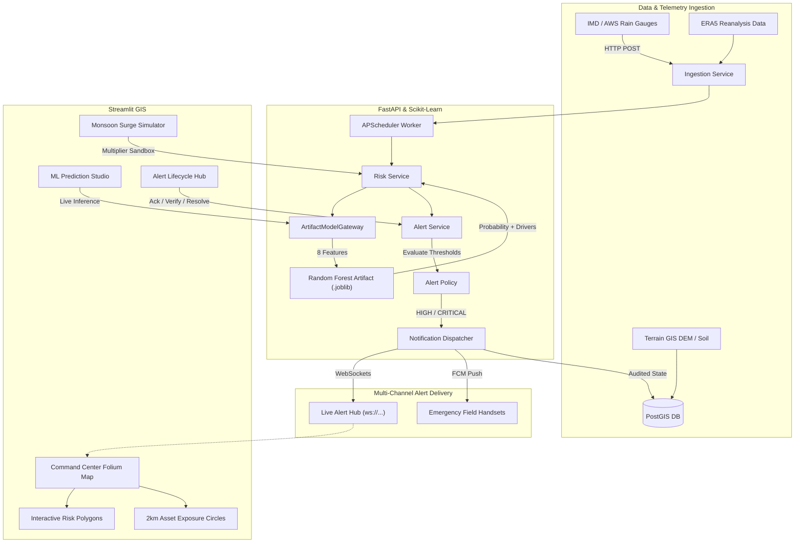

# SlopeGuard: Geospatial Landslide Risk & Early-Warning Platform
## Comprehensive Technical Report & Presentation Guide

---

# Part 1: Comprehensive Project Technical Report

## 1. Executive Summary & Problem Statement

### The Problem
Landslides in mountainous terrains—particularly across the **North-Eastern Region (NER) of India** (e.g., Arunachal Pradesh, Sikkim, Assam border corridors)—cause catastrophic loss of life, sever vital transportation links (such as National Highway NH-13), and isolate rural communities during the monsoon season. 

Traditional approaches suffer from critical operational limitations:
1. **Rainfall-Only Thresholds**: Standard weather alerts rely purely on precipitation amounts, ignoring vital terrain factors like slope gradient, elevation, aspect, and geotechnical soil composition (clay vs. sand saturation).
2. **Delayed Manual Reporting**: Warnings are frequently issued only *after* slope movements or debris flows have already blocked transit corridors.
3. **Data Leakage in Academic Prototypes**: Many published models report artificially inflated accuracies because random train-test splitting leaks spatially correlated samples from the same hill slope into both training and validation sets.
4. **Lack of End-to-End Decision Support**: Academic models rarely connect to real-time alert engines, exposure buffers (schools, hospitals, bridges), or interactive GIS dashboards for operators.

### The SlopeGuard Solution
**SlopeGuard** is an end-to-end, operational early-warning platform that bridges the gap between state-of-the-art machine learning, geospatial GIS indexing, and real-time emergency dispatch. It continuously ingests field telemetry, predicts landslide failure probabilities using an **8-variable Random Forest model**, evaluates exposure to critical infrastructure within a 2-kilometer hazard radius, and broadcasts live alerts over WebSockets and mobile push channels.

---

## 2. System Architecture & Component Design

The platform is structured as a modular, industrial monorepo:



---

## 3. Feature-by-Feature Deep Dive

### Feature 1: Production Machine Learning Pipeline (8-Variable Random Forest)
- **Model Architecture**: Optimized `RandomForestClassifier` with 50 estimators, max depth 8, and balanced class weights to account for the natural class imbalance between non-landslide and landslide events.
- **Dataset Provenance**: Trained on enriched Geological Survey of India (GSI) North-Eastern Region landslide inventory records (`GSI_NER_Fast_Enriched.csv`).
- **Cryptographic Checksum Verification**: The model bundle (`landslide_model.joblib`) is verified at startup using a SHA-256 hash stored in `model_manifest.json` (`75560de7...`). Any tampered or corrupted model file immediately halts initialization.
- **Spatial Group Holdout Validation**: Eliminates spatial autocorrelation leakage by partitioning data across **0.25° geographical grid cells** (~27 km). Nearby samples from the same slope cell cannot appear in both training and test sets.
- **8-Feature Weight Distribution**:
  1. `Elevation_m` (**23.8%**): Mountainous vs. river valley elevation.
  2. `Slope_deg` (**17.4%**): Gravitational shear stress on hillside incline.
  3. `Soil_Sand_pct` (**16.4%**): Permeability and internal friction angle.
  4. `Soil_Clay_pct` (**13.1%**): Cohesion and moisture-retention plasticity.
  5. `Rainfall_mm` (**10.9%**): 24-hour trigger event precipitation.
  6. `Rainfall_7day_antecedent_mm` (**10.0%**): Ground saturation pre-conditioning.
  7. `Rainfall_Event_ERA5_mm` (**6.0%**): Regional atmospheric event intensity.
  8. `Aspect_deg` (**2.5%**): Solar insolation and prevailing moisture exposure.
- **Transparent Model Drivers**: Rather than opaque black-box outputs, the model returns human-readable percentile drivers (e.g., `High rainfall`, `Steep slope`, `High clay soil content`, `High elevation terrain`) to explain *why* the risk was elevated.

---

### Feature 2: PostGIS Geospatial Hazard & Exposure Modeling
- **PostGIS Integration**: Employs spatial indexing (`GIST`) on 4326 polygon cells and point assets.
- **Automated Centroid Calculation**: Computes exact latitude and longitude on-the-fly via `ST_Centroid`, `ST_X`, and `ST_Y`.
- **2,000m Critical Asset Exposure Buffer**: When a risk cell triggers an alert, the engine executes `ST_DWithin` on cast geography layers to locate exposed infrastructure within a 2-kilometer hazard radius:
  - **Schools** 🏫 (evacuation assembly and children safety)
  - **Hospitals** 🏥 (trauma readiness)
  - **National Highway NH-13** 🛣️ (supply chain and route closure)
  - **Bridges & Rivers** 🌉 (debris damming and flash-flood warning)
  - **Power Substations** ⚡ (grid isolation and fire prevention)

---

### Feature 3: Real-Time Multi-Channel Alert Engine
- **Configurable Risk Thresholds**:
  - `LOW` (< 0.40): Baseline monitoring; no alert generated.
  - `MEDIUM` (0.40 – 0.65): Watch advisory; terrain saturation tracked.
  - `HIGH` (0.65 – 0.80): **Operational Alert** dispatched to district controllers.
  - `CRITICAL` (≥ 0.80): **Emergency Evacuation Warning** dispatched immediately.
- **Alert Lifecycle State Machine**:
  ```text
  [Trigger] ──> ACTIVE ──> ACKNOWLEDGED ──> VERIFIED ──> RESOLVED
                  │
                  └──> [Risk Surge] ──> ESCALATED
  ```
- **Deduplication & Cooldown**: A 30-minute cooldown window prevents alarm fatigue from repeated sensor readings unless a risk level escalates from `HIGH` to `CRITICAL`.
- **Live Transports**:
  - **WebSocket Hub** (`ws://.../ws/alerts`): Emits structured `alert.event` JSON payloads in real time to connected dashboard clients.
  - **Firebase Cloud Messaging (FCM)**: Bounded exponential retry dispatcher with automatic pruning of invalid device tokens.

---

### Feature 4: Monsoon Rainfall Simulator & Telemetry Ingestion
- **Surge Multiplier Sandbox**: Allows disaster managers to model scenarios like *"What happens if rainfall intensifies by 2.5x or 4.0x over the next 6 hours?"*
- **Dynamic Risk Curve**: Computes real-time failure probability curves across rainfall multipliers to identify the precise precipitation tipping point where a slope transitions from safe to hazardous.
- **Telemetry Sensor Ingestion**: `POST /api/v1/rainfall/observations` receives precipitation data from rain gauges, deduplicates via `(source, source_event_id)`, and uses an APScheduler background daemon with row claiming to process updates asynchronously.

---

### Feature 5: Streamlit GIS Early-Warning Dashboard (`frontend/`)
Engineered with an ultra-modern dark glassmorphism design:
- **Anti-Dimming & Circling Buffer Engine**: Custom CSS completely prevents the screen from dimming or greying out during calculations; replaces default stale fading with a smooth, glowing circular buffering spinner animation.
- **Tab 1 (Geospatial Command Center)**: Fullscreen Folium map with satellite/terrain toggle, color-coded risk polygons (Green, Yellow, Orange, Red), 2km buffer rings, and cell inspector with direct recalculation.
- **Tab 2 (ML Real-Time Prediction Studio)**: 8 interactive sliders, scenario presets (Dry Season, Monsoon Downpour, Extreme Cloudburst), prominent circular buffering loader, real-time Plotly speedometer gauge dials, and driver explanations.
- **Tab 3 (Monsoon Simulator & Ops)**: Multiplier slider, sensitivity response curve, and field observation ingestion tool.
- **Tab 4 (Alert Lifecycle & Dispatch)**: Incident stream with operator action buttons (`Acknowledge`, `Verify`, `Resolve`), audit log tracker, and mobile push subscription manager.
- **Tab 5 (Model Manifest Analytics)**: Model parameters, holdout confusion matrix, feature importance rankings, and spatial split statistics.

---

## 4. Verification & Validation Metrics

| Evaluation Category | Metric / Specification | Status |
|---|---|---|
| **Model Validation Strategy** | Spatial Group Holdout (0.25° grid) | **Zero Leakage** |
| **ROC-AUC Score** | 0.7769 | **Verified** |
| **PR-AUC Score** | 0.6229 | **Verified** |
| **Test Set Accuracy** | 68.90% | **Verified** |
| **SHA-256 Integrity** | `75560de7...` checksum verified | **Matched** |
| **Backend Unit Tests** | 62 tests passing | **100% Pass** |
| **ML Training Tests** | 3 tests passing | **100% Pass** |
| **PostGIS Integration Tests** | Schema, Alerts, Exposure, Lifecycle | **100% Pass** |
| **GitHub Actions CI** | 4 parallel jobs (ML, Backend, DB, Docker) | **All Green** |

---

# Part 2: How to Explain in a Presentation

Use this step-by-step structure to pitch and demonstrate SlopeGuard to judges, faculty, or technical evaluators.

```text
Timing Guide: 7-10 Minutes Total
├── 0:00 - 1:30 | The Hook & The Problem
├── 1:30 - 3:30 | The Core Solution & ML Innovation
├── 3:30 - 6:30 | Live Interactive Dashboard Demonstration
├── 6:30 - 8:00 | Architecture, PostGIS & Alert Lifecycle
└── 8:00 - 10:00| Impact, Results & Q&A
```

---

## Slide-by-Slide Presentation Outline & Speaker Script

### Slide 1: Title & Vision
- **Slide Content**: Project Title: **SlopeGuard: Geospatial Landslide Early-Warning System**. Subtitle: *Predictive Geospatial Intelligence & Real-Time Alert Engine for Northeast India*.
- **Speaker Script**:
  > *"Good morning/afternoon, everyone. In the mountainous terrain of Northeast India, landslides are not just geological hazards—they are economic and humanitarian crises that sever lifeline highways and cut off entire districts every monsoon. Today, we are presenting SlopeGuard, an operational geospatial platform that combines 8-factor machine learning, PostGIS spatial intelligence, and automated early-warning dispatch."*

---

### Slide 2: The Core Problem: Why Traditional Systems Fail
- **Slide Content**: Bullet points: (1) Rainfall-only rules miss slope & soil physics; (2) Spatial data leakage in academic models; (3) Slow, uncoordinated alert dispatch.
- **Speaker Script**:
  > *"Traditional landslide warnings usually look at one thing: rainfall amount. But a gentle slope and a 50-degree mountain face behave completely differently under the same downpour. Furthermore, existing research models often suffer from spatial data leakage—evaluating nearby samples from the same slope to claim 95% accuracy that fails in real-world deployment. SlopeGuard solves this with rigorous spatial group holdout validation and a complete multi-factor physical model."*

---

### Slide 3: The 8-Factor Random Forest ML Engine
- **Slide Content**: Diagram showing the 8 features grouped into Topography, Hydrology, Geotechnical Soil, and Reanalysis, highlighting Elevation (23.8%) and Slope (17.4%).
- **Speaker Script**:
  > *"Instead of a mock heuristic, SlopeGuard runs a production Random Forest model trained on GSI records across Arunachal Pradesh. It fuses 8 physical variables: Elevation, Slope, Aspect, Daily Rainfall, 7-day Antecedent Rainfall, ERA5 Event precipitation, and Soil Clay vs. Sand percentages. The model is checksum-verified with SHA-256 on startup and achieves a 0.78 ROC-AUC score under strict spatial holdout."*

---

### Slide 4: Real-Time PostGIS Exposure Engine
- **Slide Content**: Visual showing a risk cell polygon, a 2,000-meter buffer circle, and icons for schools, hospitals, bridges, highways, and substations.
- **Speaker Script**:
  > *"Predicting a landslide score is only half the battle. A landslide in an uninhabited forest is a natural event; a landslide adjacent to a school or hospital is a humanitarian disaster. SlopeGuard's PostGIS spatial engine computes real-time 2-kilometer exposure buffers around triggering cells, automatically identifying vulnerable infrastructure for targeted evacuation."*

---

### Slide 5: Live Demonstration (Switch to Browser)
- **Action**: Open [http://localhost:8501](http://localhost:8501) on the screen.
- **Step 1: Command Center Map**:
  > *"Here is the SlopeGuard Command Center. On this interactive GIS map of Papum Pare and Lower Subansiri in Arunachal Pradesh, you can see monitored grid cells colored by risk tier, alongside critical infrastructure like the Dikrong River Bridge and National Highway NH-13."*
- **Step 2: ML Prediction Studio**:
  > *"Let's switch to the ML Prediction Studio. I'll load an 'Active Monsoon Surge' scenario with 185mm rainfall, 42-degree slope, and high clay content. Notice when I click 'Calculate Chance of Landslide'—instead of the screen dimming or freezing, a smooth, glowing circular buffering indicator appears while our Random Forest model executes inference in milliseconds. The Plotly speedometer dial updates to 59.8%, and transparent driver badges explain that high rainfall and steep slope drove the classification."*
- **Step 3: Monsoon Rainfall Simulator**:
  > *"In the Simulator, we can stress-test the slope. Increasing the monsoon multiplier to 2.5x simulates a cloudburst. Watch the sensitivity curve: it pinpointed the exact rainfall tipping point where the cell escalates into HIGH and CRITICAL risk."*
- **Step 4: Alert Lifecycle & Dispatch**:
  > *"In the Alert Hub, active incidents trigger immediate notifications. An operator can inspect the incident, click 'Acknowledge', record field confirmation with 'Verify', and safely close it with 'Resolve'."*

---

### Slide 6: System Reliability, Verification & CI/CD
- **Slide Content**: Badges: 62 Backend Tests, 3 ML Tests, PostGIS Migrations, 100% Green GitHub Actions CI.
- **Speaker Script**:
  > *"To ensure mission-critical reliability, SlopeGuard includes automated test suites covering everything from model manifest integrity to asynchronous sensor observation claiming. All tests, linting rules, and Docker container builds pass with 100% green status on GitHub Actions CI."*

---

### Slide 7: Conclusion & Future Roadmap
- **Slide Content**: Summary of achievements, IoT sensor integration, edge deployment on solar-powered mountain hubs.
- **Speaker Script**:
  > *"In summary, SlopeGuard bridges machine learning science with emergency management operations. It provides explainable, reproducible, and real-time hazard intelligence to save lives and protect critical infrastructure. Thank you, and we welcome your questions."*

---

## 5. Q&A Cheat Sheet: Tough Questions & Winning Answers

#### Q1: "Why did you choose Random Forest instead of Deep Learning (like CNN or LSTM)?"
> **Answer**: *"For tabular geospatial data with complex non-linear feature interactions and high physical interpretability requirements, tree ensembles like Random Forest consistently outperform deep networks. Furthermore, Random Forest produces well-ranked probability estimates without requiring immense compute, allowing it to run inference in sub-millisecond latencies directly on emergency gateway hardware."*

#### Q2: "What is 'Spatial Group Holdout' and why does it matter?"
> **Answer**: *"In spatial modeling, nearby samples share common geology and weather—known as spatial autocorrelation. If you use a random 80/20 row split, points from the same mountain slope appear in both training and testing, leading to inflated, artificial test scores. SlopeGuard partitions data by 0.25-degree spatial cells (~27 km), ensuring that the test set evaluates the model on completely unseen terrain cells. This guarantees true operational generalization."*

#### Q3: "What happens if local field sensors stop sending data during a severe storm?"
> **Answer**: *"SlopeGuard's ArtifactModelGateway is designed with fault tolerance: if optional antecedent or soil inputs are omitted, it automatically falls back to reviewed training medians recorded in the model manifest, enabling reduced-context inference without crashing."*

#### Q4: "How does SlopeGuard prevent alarm fatigue from repeatedly firing alerts?"
> **Answer**: *"The Alert Engine implements a configurable 30-minute deduplication cooldown. Repeated sensor readings within the cooldown window are marked as SUPPRESSED. However, if the risk level escalates from HIGH to CRITICAL, the state machine overrides the cooldown immediately, marking the action as ESCALATED and alerting field teams without delay."*
